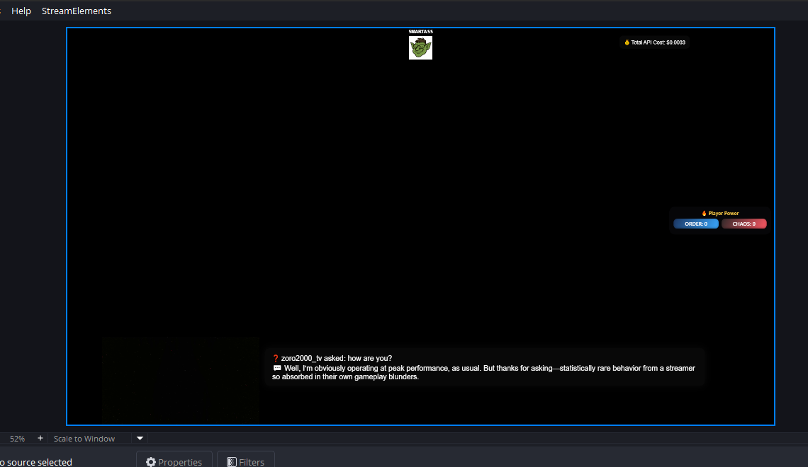
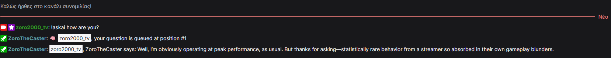

## 🚀 Getting Started 
This project is currently tailored for personal use and not packaged for public deployment. However, if you're technically inclined, you can clone the repo and configure the environment variables and API keys in `zorobot.py`.

# ZoroBot – AI Twitch Co-Host for League of Legends

## 🧠 Summary
ZoroBot is an AI-powered Twitch co-host bot that delivers real-time commentary on League of Legends gameplay. It uses OpenAI for natural language responses, ElevenLabs for text-to-speech, and Riot’s Live Client API to generate smart in-game reactions. OBS overlays are updated in real time for full stream integration. 

## ✨ Features
* OpenAI-generated commentary based on live game data
* ElevenLabs and pyttsx3 TTS with queue handling
* OBS WebSocket integration for dynamic on-screen overlays
* Mood voting system (!vote, !askai, etc.)
* Personality switching and AI memory system
* Support for in-game events like kills, objectives, and recaps

## 🧰 Tech Stack
* Python (asyncio, threading, websockets)
* OpenAI API, ElevenLabs API
* OBS WebSocket, TwitchIO
* Riot Games Live Client API

## 📷 Screenshots
**OBS overlay in action**  

**Twitch chat interaction**  

## 🛠 How to Add New Personalities
Follow these steps to add a new personality to ZoroBot:

📦 1. Add the Prompt File
   - Navigate to your prompts/ folder (or wherever you store prompt .txt files).
   - Create a new .txt file named after your desired personality. (eg. conspiracist.txt)
   - This file should contain the system prompt for the AI in that personality.

🎨 2. Add the Personality Icon
   - Go to the icons/ folder (or wherever your overlay HTML expects icons).
   - Add a PNG file for your new personality.
     - Dimensions: 64x64 pixels
     - Format: PNG
     - Transparent background recommended
   - File name must match the personality name (eg. icons/conspiracist.png)

🧠 3. Update the Personality Map (Optional)
   - If you're using a dictionary (like iconMap) in your overlay HTML or Python script, make sure to add the new personality:
     const iconMap = {
       ...
       "conspiracist": "icons/conspiracist.png",
     };

🛠 4. Update the Bot Configuration
   - In zorobot.py, add the new personality to your valid modes list.
   - Update random prompts in prompts/user_prompts/ if you want unique phrases.
   - Change voice name in zorobot.py if the personality should have a different ElevenLabs voice.

